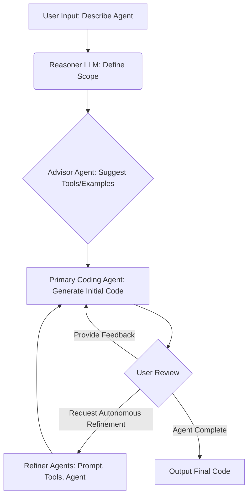

# System Patterns: Terrance (Based on Archon V6)

## Core Architecture: Agentic Workflow (LangGraph)

Terrance employs a multi-agent system orchestrated by LangGraph. This allows for separation of concerns and iterative refinement.

**Workflow:**

1.  **User Input:** User describes the desired agent via the Streamlit UI.
2.  **Reasoning/Scoping:** A dedicated LLM (Reasoner) analyzes the request and defines the high-level scope for the agent. This scope is saved (e.g., `workbench/scope.md`).
3.  **Tool/Example Advising:** An *Advisor Agent* analyzes the scope and user request, recommending relevant prebuilt tools, examples, or MCP integrations from the available library (`agent-resources/`).
4.  **Initial Code Generation:** The *Primary Coding Agent* (e.g., `archon/pydantic_ai_coder.py`) uses the scope, RAG-retrieved documentation (from Supabase), and selected tools/examples to generate the initial agent code.
5.  **Feedback/Refinement Loop:**
    *   **User Feedback:** The user can review the code and provide specific instructions for changes.
    *   **Autonomous Refinement:** Alternatively, the user can request autonomous refinement. Control passes to specialized *Refiner Agents*:
        *   `Prompt Refiner Agent`: Optimizes system prompts.
        *   `Tools Refiner Agent`: Improves tool implementation, validates/optimizes MCP configurations.
        *   `Agent Refiner Agent`: Refines overall agent configuration and dependencies.
    *   The *Primary Coding Agent* incorporates feedback (from user or refiners) and generates updated code.
6.  **Iteration:** The loop (Step 5) continues until the user is satisfied.
7.  **Output:** Archon provides the final, complete agent code and instructions.

**Visual Representation:** (See `public/ArchonGraph.png` for the original Archon LangGraph visualization)

## Key Components & File Structure

-   **UI:** `streamlit_ui.py` (Main user interface)
-   **Agent Service:** `graph_service.py` (FastAPI service hosting the agentic workflow)
-   **Core Logic:** `archon/` package (Note: directory name kept from original Archon)
    -   `archon_graph.py`: LangGraph definition.
    -   `pydantic_ai_coder.py`: Primary coding agent.
    -   `refiner_agents/`: Specialized agents.
    -   `advisor_agent.py`: Tool/example suggestion agent.
    -   `agent_prompts.py`: Centralized prompts.
    -   `agent_tools.py`: Tools available to the agents.
-   **Tool/Resource Library:** `agent-resources/`
    -   `examples/`: Example agent implementations.
    -   `mcps/`: MCP server configuration examples.
    -   `tools/`: Prebuilt Python tools.
-   **MCP Server:** `mcp/` (Optional integration for AI IDEs)
    -   `mcp_server.py`: Server implementation.
-   **Utilities:** `utils/` (Database setup, shared functions)
-   **Runtime Files:** `workbench/` (Created dynamically, e.g., `env_vars.json`, `logs.txt`, `scope.md`)
-   **Deployment:**
    -   `Dockerfile`: Main application container definition.
    -   `mcp/Dockerfile`: MCP server container definition.
    -   `run_docker.py`: Script to manage Docker builds and runs for the original Archon structure.

## Deployment Patterns

-   **Docker (Recommended):** Uses two containers managed by `run_docker.py`.
    1.  **Main Terrance (Archon) Container:** Runs Streamlit UI (port 8501) and Graph Service (port 8100).
    2.  **MCP Container:** Runs the MCP server for AI IDE integration.
-   **Local Python:** Standard Python virtual environment setup (`venv`).

## Data Management

-   **Vector Database (Supabase):** Stores crawled documentation (e.g., Pydantic AI) embeddings for RAG. Schema defined in `utils/site_pages.sql`. Setup managed via Streamlit UI.
-   **Environment Variables:** Managed via Streamlit UI, stored in `workbench/env_vars.json`.
-   **Logs:** Stored in `workbench/logs.txt`.

## Key Technical Decisions

-   **LangGraph:** Chosen for orchestrating the multi-agent workflow, enabling complex state management and iterative loops.
-   **FastAPI:** Used for the `graph_service.py` to expose the agent generation workflow as an API, facilitating decoupling from the UI and potential external integrations.
-   **Streamlit:** Selected for building the interactive user interface, allowing rapid development of data-centric applications.
-   **Docker:** Provides a consistent and reproducible deployment environment.
-   **MCP:** Adopted for standardized integration with AI IDEs.
-   **RAG:** Implemented using Supabase for retrieving relevant documentation to inform code generation.
-   **Modular Agent Design:** Separating reasoning, coding, advising, and refining into distinct agents/components.
